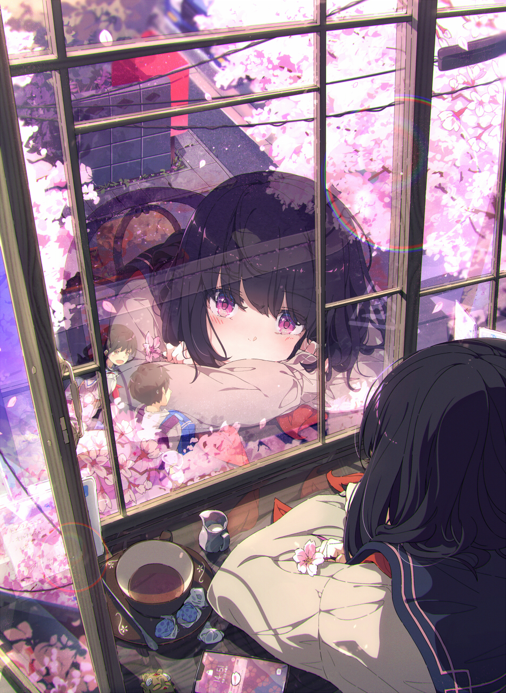

![Typing][github-sub-title:img]

	
	
	

	
	
	
	

| Stats | Tech Stack |
| --- | --- |
|  |  |
|  |  |

[github-sub-title:img]: https://readme-typing-svg.herokuapp.com?font=Playfair+Display&weight=600&size=32&duration=3500&pause=800&center=true&vCenter=true&width=460&lines=ATGXicefires
